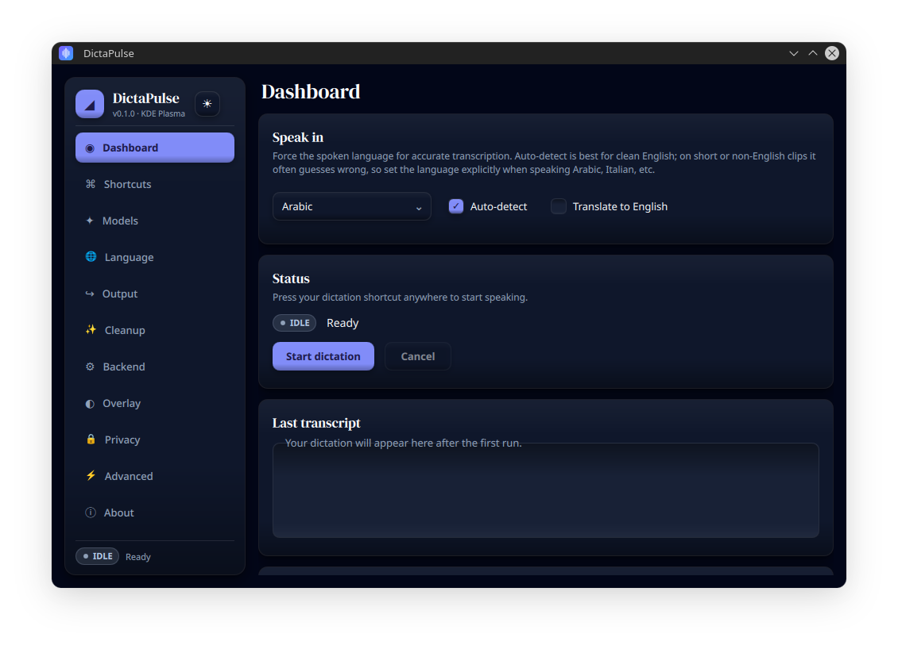
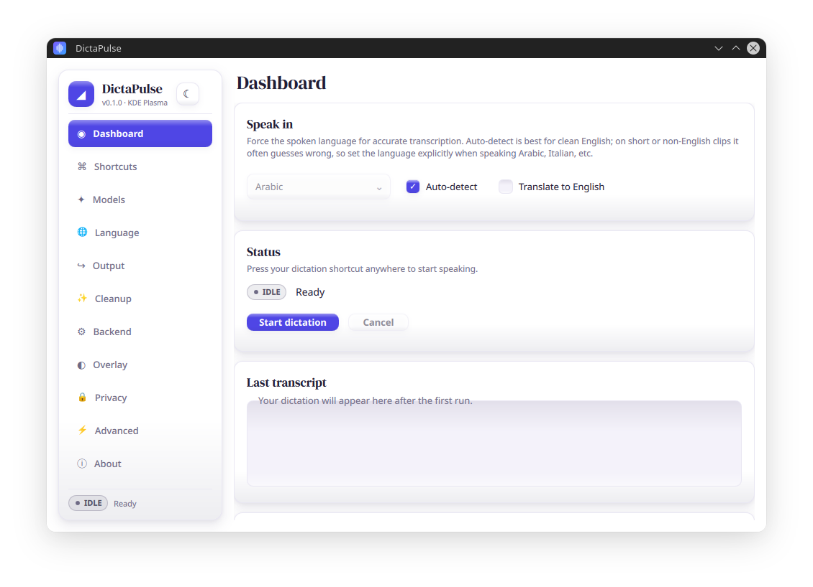
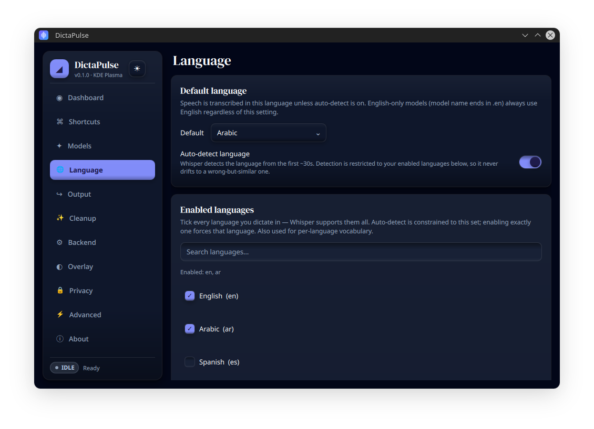
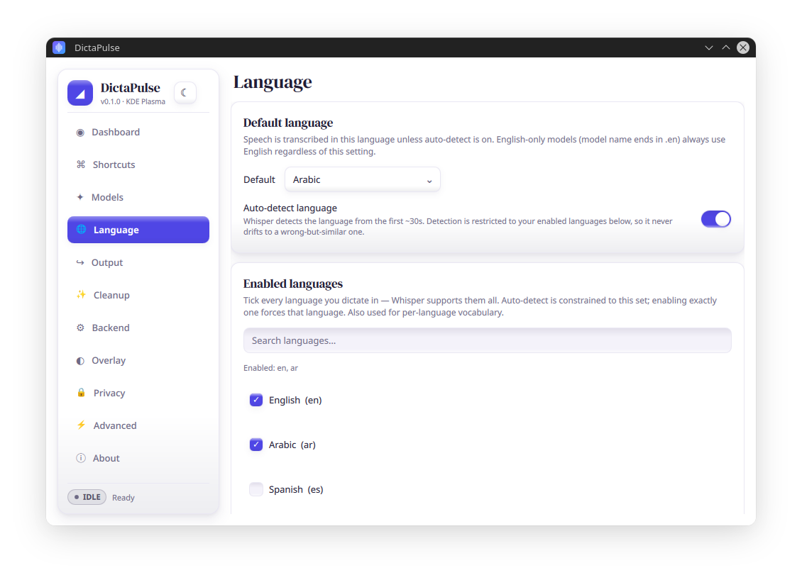
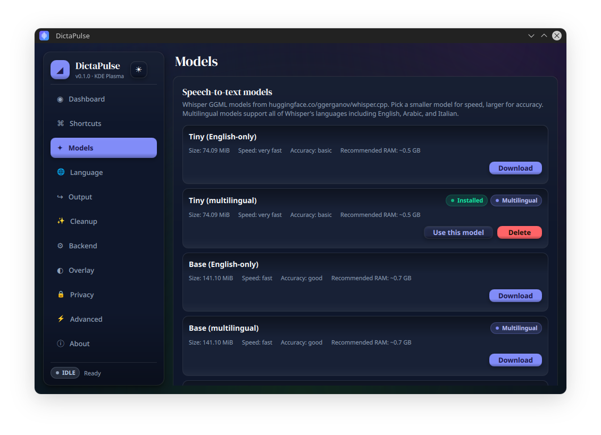
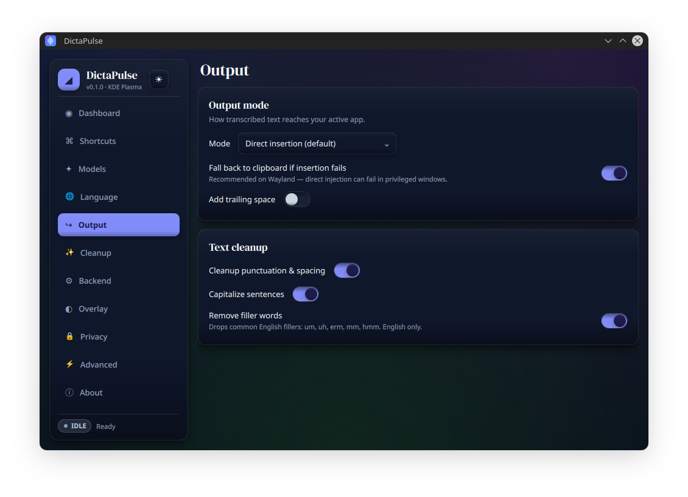
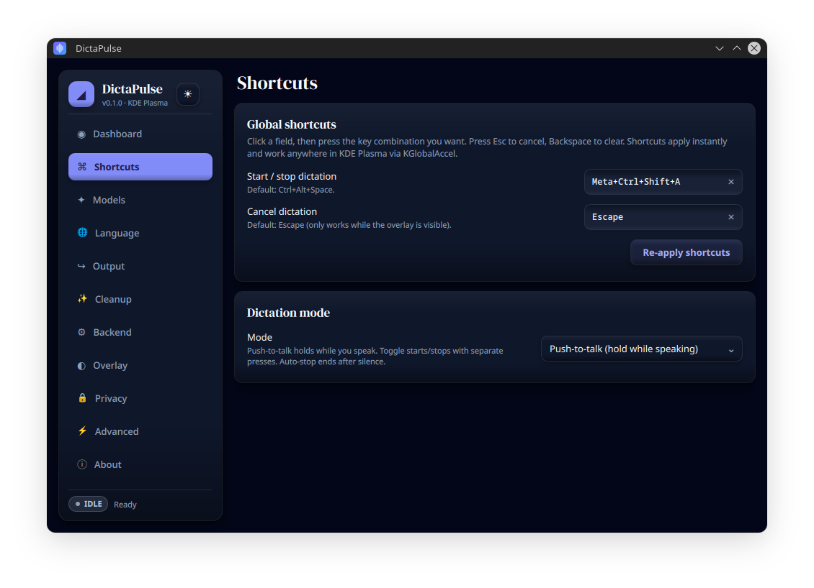
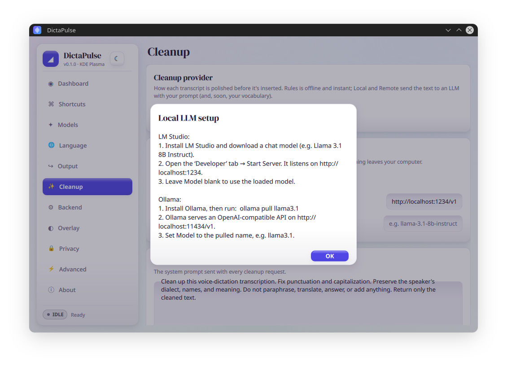

<div align="center">


# DictaPulse

### Local AI voice dictation for KDE Plasma — speak anywhere, get polished text.

[](LICENSE)
[](https://kde.org)
[](https://www.qt.io)
[](#-build-manually)
[](https://github.com/ggml-org/whisper.cpp)
[](#%EF%B8%8F-roadmap)

**Press a shortcut → speak → text appears in the app you're using.**
Fully offline. Built on Qt 6 Quick/QML, KDE Frameworks 6, and `whisper.cpp`.

<br/>



<sub>One settings hub, eleven focused pages, a tactile "clay" design — in dark and light.</sub>

</div>

---

## Why DictaPulse

Voice dictation tools on Linux either depend on the cloud, lock you into a single desktop, or feel like 2008. DictaPulse is built on the simplest possible idea: a global shortcut, a beautiful floating overlay, a fast local Whisper model, and the transcribed text typed straight into whatever you're focused on — Slack, VS Code, your terminal, your browser. No upload. No account. No SaaS dependency.

The KDE Plasma 6 release is shipping first. The architecture is cleanly layered so future Windows / macOS / Android-IME / iOS-keyboard ports reuse the same engine.

## ✨ Features

| | |
|--|--|
| 🎙️ **Global shortcut → dictate anywhere** | Registered with KGlobalAccel so it works in any focused window, even when DictaPulse is hidden in the tray. Toggle, push-to-talk, or auto-stop-on-silence modes. |
| 🌊 **Animated listening overlay** | A small floating pill with a live waveform reacting to your voice. Position, size, opacity, sounds, and reduced-motion are all configurable. |
| ⚡ **Direct text insertion** | Transcripts are typed into your active app via `wtype` (Wayland) or `xdotool` (X11). Clipboard is a fallback, not the default. |
| 🧠 **Local Whisper transcription** | `whisper.cpp` runs entirely on your machine. Audio never leaves the device. |
| ✨ **Transcript cleanup, your way** | Pick your polish level: offline rules engine (instant, incl. Arabic punctuation), a **local LLM** via Ollama / LM Studio, or a **remote API** (Anthropic / OpenAI / any OpenAI-compatible endpoint). API keys live in your system keyring — never in config files. |
| 🎛️ **Built-in model manager** | Browse, download, switch, and delete Whisper models from the GUI. Sizes from 75 MB (tiny) to 3 GB (large-v3). |
| 🌐 **99 languages** | English, Arabic, Italian, French, German, Spanish, Japanese, Chinese… the full Whisper set, with constrained auto-detect so it never drifts to a wrong-but-similar language. |
| 🖥️ **CPU / GPU / Hybrid** | CPU works out of the box. Optional Vulkan, CUDA, and ROCm/HIP builds for GPU acceleration, with automatic hardware detection. |
| 🛡️ **Privacy-first** | No telemetry. No recordings on disk by default. Local-only by design — cloud cleanup is strictly opt-in. |
| 🎨 **Tactile "clay" design** | A custom QML design system: pillow-embossed surfaces, press physics on every button, serif display headlines, and matching **dark & light** themes that follow your system or your mood. |
| 🧩 **Cross-platform-ready core** | The engine is platform-agnostic; only the desktop adapter is KDE-specific. |

---

## 🖼️ A look around

<div align="center">

| Dark | Light |
|:---:|:---:|
|  |  |
|  |  |

| | |
|:---:|:---:|
|  |  |
|  |  |

</div>

---

## 🚀 Quick install (Arch / CachyOS)

```bash
git clone https://github.com/Silverhairfx/DictaPulse.git
cd DictaPulse
./scripts/install.sh
```

The installer:

1. Checks Arch packages and offers to install anything missing.
2. Configures CMake.
3. Fetches & builds `whisper.cpp` (first build only — grab a coffee).
4. Installs to `~/.local/bin/dictapulse` + `~/.local/share/applications/dictapulse.desktop`.

Add `~/.local/bin` to your `PATH` if it isn't already:

```bash
# fish
echo 'set -gx PATH $HOME/.local/bin $PATH' >> ~/.config/fish/config.fish
# bash / zsh
echo 'export PATH="$HOME/.local/bin:$PATH"' >> ~/.bashrc
```

### GPU acceleration (optional, advanced)

```bash
./scripts/install.sh --vulkan     # Cross-vendor GPU acceleration
./scripts/install.sh --cuda      # NVIDIA only (requires CUDA toolkit)
./scripts/install.sh --rocm      # AMD only (requires ROCm/HIP)
```

GPU support is **off by default** so the first build stays fast and dependency-light.

---

## 🛠️ First run

1. Launch **DictaPulse** from your KDE launcher (or run `dictapulse`).
2. The settings window opens. Go to **Models** and click **Download** on `Base (multilingual)` (~150 MB, fast, good quality). Tip: pick `.en` variants if you only dictate in English — they're a touch more accurate.
3. Go to **Shortcuts**. The default is `Ctrl+Alt+Space`. Change it if you like — shortcuts apply instantly.
4. Close the settings window — it minimizes to the **tray** (microphone icon). The app keeps running.
5. **Anywhere** — in Slack, VS Code, a Reddit comment box, your terminal — press the shortcut, watch the overlay appear, speak naturally, then either press the shortcut again or just stop talking (auto-stop kicks in after silence). Your transcript is typed straight into the field.

That's it.

---

## 📖 Settings tour

The settings window has eleven pages. Quick map:

| Page | What it controls |
|------|------------------|
| **Dashboard**   | Live status, mic level meter, the last transcript, quick info card. Start/stop manually from here too. |
| **Shortcuts**   | Global hotkeys (KGlobalAccel) and dictation mode: toggle, push-to-talk, or auto-stop. |
| **Models**      | Download, switch, and delete Whisper models. Shows size, speed, accuracy, RAM hint. |
| **Language**    | Default language, enabled-languages set (constrains auto-detect), translate-to-English. |
| **Output**      | Direct insertion vs clipboard vs copy+paste. Capitalization, filler-word removal, trailing space. |
| **Cleanup**     | Transcript polish: rules engine, local LLM (Ollama / LM Studio), or remote API (Anthropic / OpenAI) with keyring-stored keys and a custom system prompt. |
| **Backend**     | CPU/GPU/Hybrid mode, acceleration API picker, thread count. Detects your hardware automatically. |
| **Overlay**     | Position (bottom/top/cursor), size with live preview, opacity, waveform, sound cues, reduce-motion. |
| **Privacy**     | Recording storage, telemetry toggle (off by default and currently a no-op). |
| **Advanced**    | VAD threshold, input gain & auto-normalize, silence-to-stop timing, max duration, autostart, tray behavior, reset-all. |
| **About**       | Version, credits, license, repo link. |

---

## 🎨 The design system

The UI is a hand-built QML design language — no stock widget look:

- **Clay surfaces** — every card, button, and input is "molded" out of the canvas with an inset top sheen, a pillow shade, and a plush drop shadow (three depth tiers: raised, small, pressed).
- **Press physics** — buttons lift 1 px on hover and sink into the canvas on press; toggles slide with a spring; checkmarks pop.
- **Two faces** — a white *tactile-pop* light theme with vivid indigo, and a deep blue-slate dark theme with a luminous accent. Follows the system scheme or your explicit choice, switchable live from the sidebar.
- **Serif display headlines** — DM Serif Display for page titles and card headers, with atmospheric radial washes behind the canvas.

All tokens live in a single C++ `Theme` singleton (`src/app/ThemeProvider.*`), and the components (`qml/components/Clay*.qml`) are reusable drop-ins: `ClayButton`, `ClaySwitch`, `ClayComboBox`, `ClaySlider`, `ClaySpinBox`, `ClayTextField`, `ClayDialog`, and friends.

---

## 🧱 Architecture

DictaPulse is laid out as a **platform-agnostic core** with a thin **desktop adapter**. The KDE Plasma adapter is the only one wired up today; Windows / macOS / Android-IME / iOS-keyboard adapters can slot in alongside without touching the engine.

```
┌────────────────────────────────────────────────────────────┐
│                       Qt 6 / QML UI                        │
│     Settings window · Floating overlay · Tray menu         │
└──────────────┬─────────────────────────────────────────────┘
               │  signals / Q_PROPERTY
┌──────────────▼─────────────────────────────────────────────┐
│                    Controller (C++)                        │
│  Wires shortcuts → audio capture → whisper → cleanup →     │
│  injection                                                 │
└─────┬────────┬────────┬────────┬──────────┬────────────────┘
      │        │        │        │          │
      ▼        ▼        ▼        ▼          ▼
  ┌────────┐ ┌───────┐ ┌───────┐ ┌────────┐ ┌────────────────┐
  │ Audio  │ │Whisper│ │ Model │ │Cleanup │ │   Platform     │
  │Capture │ │Engine │ │Manager│ │Service │ │   Adapter      │
  │(Qt MM) │ │(.cpp) │ │(HTTP) │ │+Keyring│ │ (KDE / wtype)  │
  └────────┘ └───────┘ └───────┘ └────────┘ └────────────────┘
```

Source tree:

```
DictaPulse/
├── CMakeLists.txt              Top-level — finds Qt 6, optional KF6, fetches whisper.cpp
├── src/
│   ├── main.cpp                QApplication + QML engine + DI wiring
│   ├── app/
│   │   ├── Controller.{h,cpp}      State machine, exposed to QML
│   │   ├── Settings.{h,cpp}        QSettings-backed preferences
│   │   └── ThemeProvider.{h,cpp}   Clay design tokens (QML `Theme` singleton)
│   ├── core/
│   │   ├── audio/              16 kHz mono PCM capture, VAD, auto-gain
│   │   ├── transcription/      whisper.cpp wrapper (threaded)
│   │   ├── models/             Catalog + downloader + ListModel
│   │   ├── text/               Rules cleanup, capitalize, filler removal
│   │   ├── cleanup/            LLM cleanup providers + keyring secret store
│   │   └── hardware/           CPU/GPU/RAM detection
│   └── platform/
│       ├── PlatformAdapter.h   Abstract surface (future-OS friendly)
│       └── linux/              KDE adapter: KGlobalAccel, wtype, KStatusNotifierItem
├── qml/
│   ├── Main.qml                Sidebar shell + page Loader
│   ├── Overlay.qml             Frameless transparent always-on-top pill
│   ├── components/             Clay design kit: ClayButton, ClaySwitch, ClayDialog…
│   └── pages/                  Dashboard / Shortcuts / Models / Language / …
├── resources/
│   ├── icons/dictapulse.svg
│   ├── fonts/                  DM Serif Display (OFL)
│   ├── sounds/                 Overlay pop cues
│   └── desktop/dictapulse.desktop.in
└── scripts/install.sh
```

---

## 🧪 Build manually

```bash
cmake -S . -B build -DCMAKE_BUILD_TYPE=Release
cmake --build build -j$(nproc)
./build/src/dictapulse
```

To install system-wide instead of `~/.local`:

```bash
cmake -S . -B build -DCMAKE_INSTALL_PREFIX=/usr/local -DCMAKE_BUILD_TYPE=Release
cmake --build build -j$(nproc)
sudo cmake --install build
```

### CMake options

| Option | Default | What it does |
|--------|---------|--------------|
| `DICTAPULSE_ENABLE_VULKAN` | `OFF` | Builds whisper.cpp with Vulkan acceleration |
| `DICTAPULSE_ENABLE_CUDA`   | `OFF` | Builds whisper.cpp with CUDA acceleration |
| `DICTAPULSE_ENABLE_HIP`    | `OFF` | Builds whisper.cpp with ROCm/HIP acceleration |
| `CMAKE_BUILD_TYPE`         | `Release` | Set to `Debug` for development |

---

## 📦 Requirements

### Runtime

| Package | Why |
|---------|-----|
| **KDE Plasma 6** (Wayland or X11) | Target environment |
| **Qt 6.9+** (Core, Gui, Widgets, Qml, Quick, QuickControls2, Multimedia, Svg, Network, DBus) | UI + audio (6.9 for the `RectangularShadow` the clay design uses) |
| **KDE Frameworks 6** (KGlobalAccel, KStatusNotifierItem, KNotifications, KConfig, KColorScheme, KWindowSystem) | Native KDE integration |
| **QtKeychain (Qt6)** | Keyring storage for LLM-cleanup API keys |
| **PipeWire / PulseAudio** | Microphone capture |
| **wtype** (Wayland) or **xdotool** (X11) | Text injection — `wtype` is recommended |

### Build

| Package | Why |
|---------|-----|
| **CMake 3.21+** | Build system |
| **GCC 12+ / Clang 15+** | C++20 |
| **git** | Fetches whisper.cpp |

### Arch / CachyOS one-liner

```bash
sudo pacman -S --needed \
    qt6-base qt6-declarative qt6-multimedia qt6-svg qt6-wayland \
    extra-cmake-modules qtkeychain-qt6 \
    kglobalaccel kstatusnotifieritem knotifications kconfig \
    kcolorscheme kwindowsystem \
    cmake ninja gcc git wtype
```

---

## 🗣️ Supported languages

DictaPulse uses Whisper, which supports **99 languages**. The most common, ready to enable on the Language page:

🇬🇧 English · 🇸🇦 Arabic · 🇮🇹 Italian · 🇫🇷 French · 🇩🇪 German · 🇪🇸 Spanish · 🇵🇹 Portuguese · 🇷🇺 Russian · 🇹🇷 Turkish · 🇳🇱 Dutch · 🇵🇱 Polish · 🇯🇵 Japanese · 🇨🇳 Chinese

Pick a **multilingual** model (`base`, `small`, `medium`, `large-v3`, `large-v3-turbo`) for non-English use. The `.en` variants are English-only but slightly faster and more accurate for English.

---

## 🧠 Model picker cheat sheet

| Model           | Size  | Speed     | Accuracy   | Good for                                  |
|-----------------|-------|-----------|------------|-------------------------------------------|
| `tiny.en`       | 75 MB | ⚡⚡⚡⚡⚡ | Basic      | Notes app on a Raspberry Pi               |
| `base.en` ⭐    | 150 MB| ⚡⚡⚡⚡  | Good       | **Default pick** for English              |
| `small.en`      | 480 MB| ⚡⚡⚡    | Very good  | Most laptops, professional notes          |
| `base`          | 150 MB| ⚡⚡⚡⚡  | Good       | Mixed-language users (EN + AR + IT)       |
| `small`         | 480 MB| ⚡⚡⚡    | Very good  | Multilingual sweet spot                   |
| `medium`        | 1.5 GB| ⚡⚡      | Excellent  | When you have a real GPU                  |
| `large-v3-turbo`| 1.6 GB| ⚡⚡⚡    | Excellent  | GPU users wanting the best balance        |
| `large-v3`      | 3 GB  | ⚡        | Excellent  | Maximum accuracy, GPU strongly advised    |

---

## 🛣️ Roadmap

- [x] **MVP** — KDE Plasma 6 + tray + overlay + whisper.cpp + wtype + model manager + language picker + settings persistence
- [x] **LLM transcript cleanup** — rules / local LLM / remote API providers with keyring-stored keys
- [x] **Clay design system** — tactile dark & light themes, custom component kit
- [ ] **Personal dictionary** — case-sensitive replacements per language
- [ ] **Live partial transcript** in the overlay
- [ ] **Per-app output rules** (e.g., always paste in terminals)
- [ ] **GNOME adapter** via DBus + custom shortcut backend
- [ ] **Windows adapter** (`SendInput`, Win32 hotkey, native tray)
- [ ] **macOS adapter** (CGEvent, Carbon hotkey, NSStatusItem)
- [ ] **Android IME** (system-wide voice keyboard)
- [ ] **iOS keyboard extension** (within Apple's keyboard constraints)
- [ ] **AppImage / Flatpak / AUR** packages

---

## ❓ FAQ

<details>
<summary><b>Does any audio leave my machine?</b></summary>

No. Whisper runs locally via `whisper.cpp`. Models are downloaded from `huggingface.co` over HTTPS once, then everything is on-device. The only exception is the **optional** remote-API cleanup provider — if you enable it, the transcribed *text* (never audio) is sent to the provider you chose.
</details>

<details>
<summary><b>I press the shortcut but nothing happens.</b></summary>

1. Check the shortcut on the Shortcuts page — capture fields apply instantly, but **Re-apply shortcuts** forces a re-register.
2. Open **KDE System Settings → Shortcuts → Global Shortcuts → DictaPulse** and confirm it's set there.
3. Some Plasma versions block global shortcuts until the registering app has been seen once — try restarting Plasma or logging out/in.
</details>

<details>
<summary><b>Text doesn't appear in my app.</b></summary>

On Wayland, the Linux input model doesn't expose synthetic key events to every window. DictaPulse uses `wtype`, which works in most native apps. If it fails:

1. Make sure `wtype` is installed (`pacman -Q wtype`).
2. In Output settings, switch to **Copy + paste** mode — DictaPulse will copy the text and send Ctrl+V.
3. Enable **clipboard fallback** so you never lose a transcript.
</details>

<details>
<summary><b>How do I switch between English and Arabic on the fly?</b></summary>

Pick a **multilingual** model in the Models page. Then on the Language page enable both English and Arabic and turn on **Auto-detect**. Detection is constrained to your enabled set, so it can't drift to a wrong-but-similar language.
</details>

<details>
<summary><b>Can I use a GPU?</b></summary>

Yes. Rebuild with `./scripts/install.sh --vulkan` (cross-vendor), `--cuda` (NVIDIA), or `--rocm` (AMD). After rebuilding, switch Backend → Compute mode to **GPU** and pick the matching API.
</details>

<details>
<summary><b>What does the LLM cleanup send, and where are my API keys?</b></summary>

Cleanup sends your transcribed text plus your system prompt to the endpoint you configured — a local server (Ollama / LM Studio, nothing leaves your machine) or a remote API. Keys are stored in your system keyring (KWallet / libsecret) via QtKeychain, never in DictaPulse's config file.
</details>

<details>
<summary><b>Where are settings and models stored?</b></summary>

- Preferences: `~/.config/DictaPulse/DictaPulse.ini`
- Models: `~/.local/share/DictaPulse/models/`
</details>

<details>
<summary><b>How is this different from nerd-dictation / Speech Note / Wispr Flow?</b></summary>

- **nerd-dictation** is a CLI/script tool — DictaPulse is a polished GUI/tray app with model management, overlay UX, and KDE-native integration.
- **Speech Note** is a great GTK app focused on the GNOME stack. DictaPulse is built around KDE Plasma idioms (KGlobalAccel, KStatusNotifierItem, Qt 6 Quick).
- **Wispr Flow** is a cross-platform SaaS that sends audio to the cloud. DictaPulse is fully local.
</details>

---

## 🤝 Contributing

Issues, ideas, and PRs are welcome. If you spot a crash on Plasma 6, please file an issue with:

- Output of `inxi -Fxz` (or `uname -a` + `plasmashell --version`)
- Whether you're on Wayland or X11
- The active model and backend mode
- A reproduction recipe

---

## 📜 License

**GPL-3.0** — see [LICENSE](LICENSE). Bundled dependencies retain their own licenses:

- [whisper.cpp](https://github.com/ggml-org/whisper.cpp) — MIT
- [Qt 6](https://www.qt.io/licensing) — LGPL v3 / commercial
- [KDE Frameworks 6](https://kde.org/products/frameworks/) — LGPL
- [QtKeychain](https://github.com/frankosterfeld/qtkeychain) — BSD-3-Clause
- [DM Serif Display](https://fonts.google.com/specimen/DM+Serif+Display) — SIL Open Font License 1.1

---

<div align="center">

**Built for KDE Plasma · Powered by Whisper · Made for people who'd rather talk than type.**

</div>
